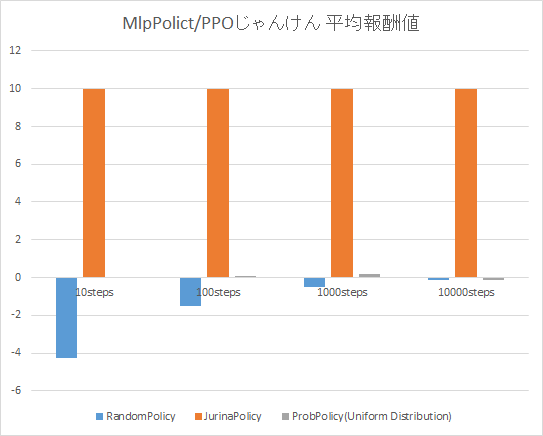

# Rock-Paper-Scissors サンプル

じゃんけん対戦の強化学習サンプルコードです。

以下のライブラリを使用しています。

* OpenAI Gym
* Stable Baselines3 / PyTorch
* flask, docopt

## インストール

* [Anaconda](https://www.anaconda.com/products/individual) をインストール、`conda env` コマンドを使い実行用環境を構築、`conda activate`コマンドで環境に入る
* `conda install pytorch torchvision cpuonly -c pytorch`
* `pip install stable-baselines3[extra]`
* `git clone https://github.com/coolerking/rock-paper-scissors.git`

## 使い方

### トレーニング

* `cd rock-paper-scissors`
* `python train.py`

### トレーニングの可視化

* `tensorboard --logdir play_logs`
* ブラウザで `http://127.0.0.1:6006/` を開く

引数の`logdir`のパスを `prob_dist_logs`や`jurina_logs`に変更することでほかの学習モデルのトレーニング可視化が可能です。

停止はCtrl+C。

### 評価

学習済みモデルの平均報酬値を標準出力へ表示します。

* `python eval.py`

以下のグラフは、平均報酬値結果を実行し、まとめたものです。

### Webアプリケーション実行

じゃんけんAI対戦ができるWebアプリケーションを起動します。

* `cd rock-paper-scissors`
* `conda install flask`
* `pip install docopt`
* `python server.py`

停止はCtrl+Cを押します。

* ブラウザで `http://127.0.0.1:5000/` を開く

#### モデルのリロード

* ブラウザで `http://127.0.0.1:5000/reload` を開く

## あれ？

動作させると、「あれ？」となるとおもいます。
実は上記の通り実行したWebじゃんけんアプリを何度か使うと、プレイヤーはAIがかならず1つの手を出し続けることに気づくと思います。

AI側の手をちらしたいと考えた時、どのようにこのコードを変更すればよいかは各自で考えてみてください。

ちらした手を出すことが収益最大化につながるようにするには..がヒントです。

> オレは
> ようやくのぼりはじめた
> ばかりだからな
>  
> このはてしなく遠い
> 強化学習坂をよ..
>
> 未完

## ライセンス

* 本サンプルコードは [MITライセンス](./LICENSE) 準拠です。

### 謝辞

上記OSS以外にも、以下のサイトを活用しています。

* 画像イメージは [いらすとや](https://www.irasutoya.com) より引用しています。
* Webアプリケーション(クライアントサイド側)は [jQuery](https://jquery.com/) を使用しています。
* Web画面上のボタンは、[CSSで作る！押したくなるボタンデザイン100（Web用）](https://saruwakakun.com/html-css/reference/buttons) より引用しています。
* [男坂](https://ja.wikipedia.org/wiki/%E7%94%B7%E5%9D%82) 車田正美
